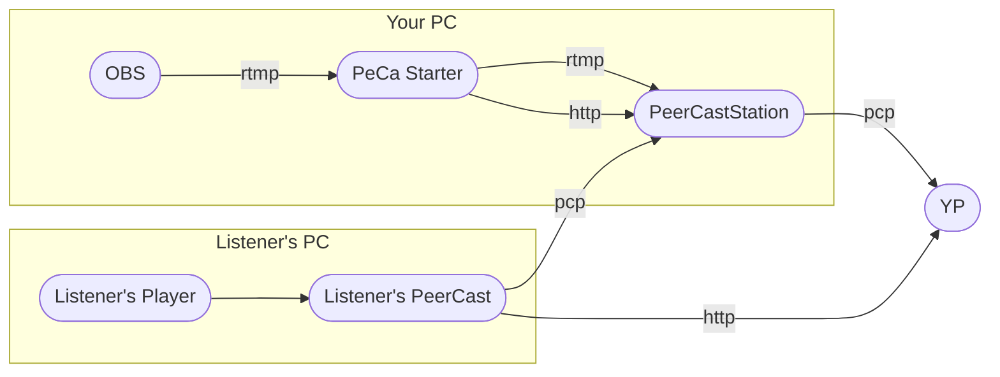

PeCa Starter 6   
============

概要
--------
PeerCastStation での配信を補助するツールです。

動作環境
--------

- Windows 11
- PeerCastStation
- OBS

使い方
--------

1. アプリを起動して初期設定を行います。
   1. 「チャンネル名」を入力します。
   2. PeerCastStation を起動し、PeerCastStation のポート番号と「PeerCastStation の通信用 TCP ポート番号」が一致していることを確認します。
   3. OBS を起動し、配信サーバーを rtmp://localhost/live/livestream に設定して、「PeCa Starter の RTMP 待ち受け TCP ポート番号」が 1935 になっていることを確認します。
2. YP 設定、チャンネル情報を設定します。
3. PeerCastStation と OBS を起動します。
4. OBS で配信を開始すると、自動で PeerCastStation のチャンネルが作成されます。
5. OBS で配信を終了すると、自動で PeerCastStation のチャンネルが削除されます。

システム構成
----

